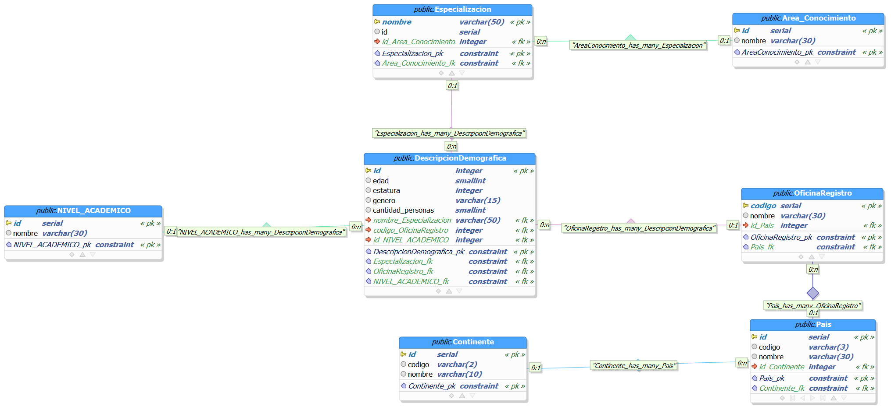

# Análisis de un conjunto de datos usando diagramas relacionales y de entidad-relación, base de datos PostreSQL y Python.

*Lee esto en otros idiomas: [English](README.md), [Español](README.es.md)*.

El conjunto de datos aquí usado es público y puede puede ser consultado en el [presente enlace](https://www.datos.gov.co/Estad-sticas-Nacionales/Colombianos-registrados-en-el-exterior/y399-rzwf).

## Descripción 

En el conjunto de datos nos presentan un esquema general demográfico de una persona y cuántos colombianos emigrantes pertenecen a esta. En nuestro análisis acordamos los siguientes datos como variables de interés:

<center>

|       Variable       | Descripción                                                                |
| :------------------: | :------------------------------------------------------------------------- |
|         Edad         | Edad actual dada en años.                                                  |
|   Especialización    | Carrera que desempeña.                                                     |
| Área de conocimiento | Campo en el cual pertenece la especialización.                             |
|   Nivel académico    | El nivel educativo alcanzado.                                              |
|  País de residencia  | País actual en el que vive.                                                |
| Oficina de registro  | Lugar en el cual llevó a cabo su registro <br> consular.                   |
|        Género        | Género en el cual está catalogado; <br> masculino, femenino o desconocido. |
|       Estatura       | Altura en centímetros.                                                     |
| Cantidad de personas | La cantidad de personas que coinciden <br> con la descripción demográfica. |

</center>

## Configuración.

En lo que respecta a la implementación, dado el diagrama relacional:



la gran cantidad de identificadores no pertenecientes al dataset (lo cual implica hacerlo manualmente) sumado a la dimensión de los datos presentes en el [archivo CSV](data/colombianos_registrados_exterior.csv.zip), consideramos más pertinente usar inserciones con python usando hashmaps (diccionarios) y colas en lugar de usar el lector nativo que ofrece PostgreSQL ([copy](https://www.postgresql.org/docs/current/sql-copy.html)).

A su vez, consideramos idóneo comprimir el [archivo CSV](data/colombianos_registrados_exterior.csv) para optimizar el espacio ocupado en el repositorio.

### Requisitos

- [`python3.10`](https://www.python.org/downloads/release/python-3100/)
- [postgresql >= 13](https://www.postgresql.org/download/)

### Entorno de desarrollo

Nosotros usamos [`venv`](https://docs.python.org/3/library/venv.html). Si también deseas usar la misma herramienta, puedes abrir una terminal de comandos y digitar lo siguiente:
- Unix-Like:
```bash
# Ajustando el entorno de python
python -m venv env
source ./env/bin/activate
pip install -r requeriments.txt

# Creando base de datos y tablas

# Se asume que no se requiere autentificación para ello
# Como también que el actual usuario está en el role "postgres"
db_name="colombianos_registrados_exterior"
user="postgres"
file="./data/${db_name}.sql"

psql -lqt | awk '{print $1}' | grep -qw $db_name ||
    createdb -O $user $db_name
psql -d $db_name -f $file
```
- Windows (Tienes que asegurarte de que python esté en tu [path](https://docs.python.org/3/using/windows.html)):
```powershell
# Ajustando el entorno de python
python -m venv env
.\env\Scripts\activate
pip install -r requeriments.txt
```
### Variables de entorno

Están presentes en el archivo [settings.py](settings.py). Las únicas que deberías modificar son las de conexión.

```python
class Connection:
    DATABASE = "hi_mom" # El nombre de tu base de datos
    USER = "n_word" # El usuario con el te conectarás
    PASSWORD = "123" # La contraseña de ese usuario
    HOST = "127.0.0.1" # La dirección IP
    PORT = "5432" # El puerto en el cual se encuentra el servicio PostgreSQL
```

## Explicacion del directorio
Para iniciar se tiene la carpeta Entregas, en esta se tienen las entregas realizadas del proyecto.

La carpeta data contiene la base de datos en formato sql y los datos en .csv

Después, se tiene la carpeta modules, que hace referencia a los modulos. eEn primer lugar se tiene el executor que ejecuta las busquedas SQL. El parser un traductor que convierte las cadenas de texto a SQL. El reader lee las sentencias SQL o CSV.

Finalmente tenemos el main:

Tenemos el table_viewer, para poder visualizar los datos, que requiere el nombre de la tabla; los filtros que se refiere a los limitadores y agrupadores y las columnas que se quieren mostrar, siendo una lista de strings sobre las columnas que se desea mostrar, junto con la opcion de mostrar el nombre de las columnas.

Por otro lado, se tiene la función data_insertion, que inicializa el ejecutor csv y la querly; se indican los datos invalidos; las columnas, el valor inicial de su id como el registro de las llaves primarias ya ingresadas de cada tabla; y una única consulta que servirá como cola a todos los inserts necesarios, separados por punto y coma. Lo único que resta es iterar las filas del CSV, siendo el orden de ejecución de las tablas según cuantas   relaciones tenga esta (de menor a mayor). En el momento que encuentre que alguna tupla aún no ha sido agregada a la tabla, es decir, que aún no este en registrador de la tabla, será agregada a la cola de la query.

### Datos no considerados

Para el desarrollo del proyecto, se decidio no usar 

### Importante
No se modifica el .gitignore, requeriments.txt y settings.py

